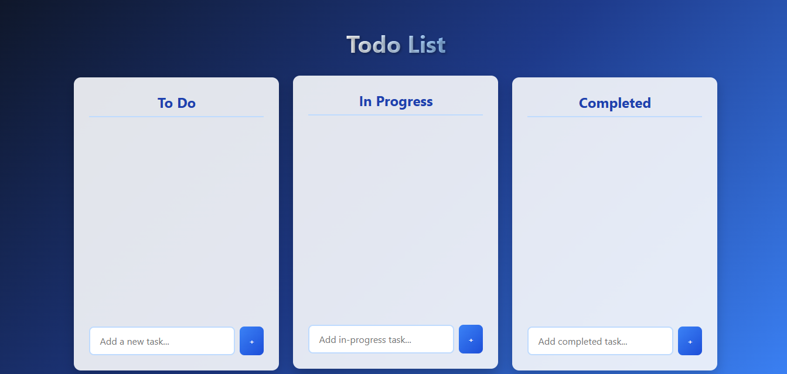

# 🚀  Todo List Application



&#x20;

A sleek and intuitive Todo List application featuring drag-and-drop functionality, real-time updates, and persistent local storage. Organize your tasks effortlessly into **To Do, In Progress, and Completed** categories.

---

**Live Demo:** [Demo](https://shivamattri05.github.io/To-Do-List-for-Micro-IT-/)

## ✨ Features

✅ **Modern UI** – Stunning gradient backgrounds and smooth animations
📝 **Task Management** – Create, edit, and delete tasks with ease
🖱️ **Drag & Drop** – Effortlessly move tasks between categories
💾 **Persistent Storage** – Saves tasks automatically using localStorage
📱 **Responsive Design** – Works flawlessly on all devices
🔄 **Instant Updates** – No page reloads, real-time interactions
🎛️ **Interactive Feedback** – Visual cues for smooth user experience

---

## 🛠️ Technologies Used

* **HTML5** – Semantic structure for easy maintenance
* **CSS3** – Flexbox for dynamic layouts & responsive design
* **JavaScript (ES6)** – Interactivity & real-time updates
* **Web Storage API** – LocalStorage for task persistence

---

## 🚀 Getting Started

### Prerequisites

* A modern web browser (Chrome, Firefox, Safari, Edge)
* No installation needed! Just open the file in your browser.

### Cloning the Repository

1. Open your terminal and navigate to the desired directory:

   ```bash
   cd path/to/your/directory
   ```

2. Clone the repository:

   ```bash
   git clone https://github.com/ShivamAttri05/To-Do-List-for-Micro-IT-.git
   ```

3. Navigate to the project folder:

   ```bash
   cd To-Do-List-for-Micro-IT-
   ```

### Usage Instructions

1. Open `index.html` in your browser.
2. Add tasks by:

   * Typing in the input field and pressing **Enter**
   * Clicking the **+ (Add Task)** button
3. Organize tasks by dragging them between columns.
4. Edit tasks by clicking the **✏️ (Edit)** icon.
5. Delete tasks by clicking the **🗑️ (Delete)** icon.

---

## 📂 Project Structure

```
📂 Enhanced-Todo-App
├── 📄 index.html  # Main HTML file
├── 📄 style.css   # Styles for the UI
├── 📄 script.js   # Core functionality
└── 📂 assets      # Icons, images, etc.
```

---

## 📌 Future Enhancements

🚀 **Dark Mode** – User-friendly theme switching
📅 **Due Dates** – Task scheduling with reminders
📊 **Analytics Dashboard** – Track productivity statistics

---

### 🎉 Enjoy a seamless and productive task management experience!
